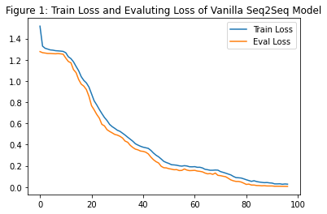
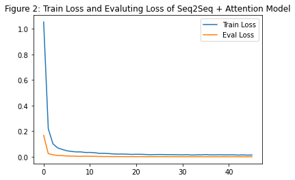

# Seq2Seq Attention Model
This is an implementation of Sequence to Sequence model with Attention mechanism in PyTorch.

## Toy Problem
An automatically-generated data will contain sequences with repeated and unordered letters. Such sequences must be mapped to alphabetically-sorted sequences of unique letters. Here are a few examples:

|Input | Output|
|------|-------|
|`ccccaaabb`       |   `abc`  |
|`vvvrxduuu`        |   `druvx`  |
|`sddvvvzzuuuxxx`   |   `dsuvxz`  |

## Implementation
We build 2 models:
- `Vanilla Seq2Seq` model used LSTM in Encoder and Decoder.
- `Seq2Seq + Attention` model.

## Results
<table>
    <tr><td colspan="2">Loss after each epoch ($N_{epoch}=100$)</td></tr>
    <tr>
        <td></td>
        <td></td>
    </tr>
</table>

## Discussion
- With validation data set, the accuracy performance of 2 models are equivalent (**99.8%** vs **99.96%**). *Seq2Seq with Attention* overperforms slightly.
- With test data set, the accuracy performance of 2 models are also equivalent (**99.36%** vs **99.92%**). *Seq2Seq with Attention* also performs better slightly.
- `Figure 1` and `Figure 2` presents the loss at each epoch for *Vanilla Seq2Seq* model and *Seq2Seq with Attention* model. The loss function of *Seq2Seq with Attention* model converges quicker with less number of epoches than the *Vanilla Seq2Seq* model. That means with less computational step, *Seq2Seq with Attention* model will achieve an equivalent performance with *Vanilla Seq2Seq* model.
- Besides, one thing we can notice is the evaluating loss is less than training loss at each epoch step. This is unusual and interesting. However, it could be explained as the input and output has a clear formula of transformation that the output is ordered character-deduplicated string of the input. So that training and validating data set are genenerated without any human/third-party error. In this fashion, because there are less number of samples in validating set (5000/20000) and these samples may be not as difficult/long as in the training set, the model performs better in validating data set.

## References
- [Effective Approaches to Attention-based Neural Machine Translation" (2015)](https://arxiv.org/pdf/1508.04025.pdf)
- [Attention Is All You Need (2017)](https://arxiv.org/pdf/1706.03762.pdf)

